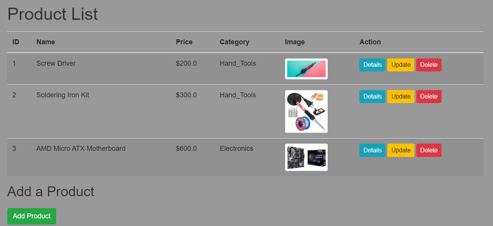
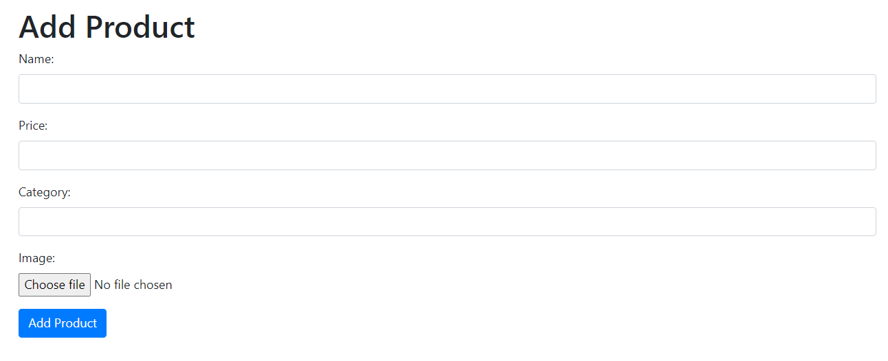
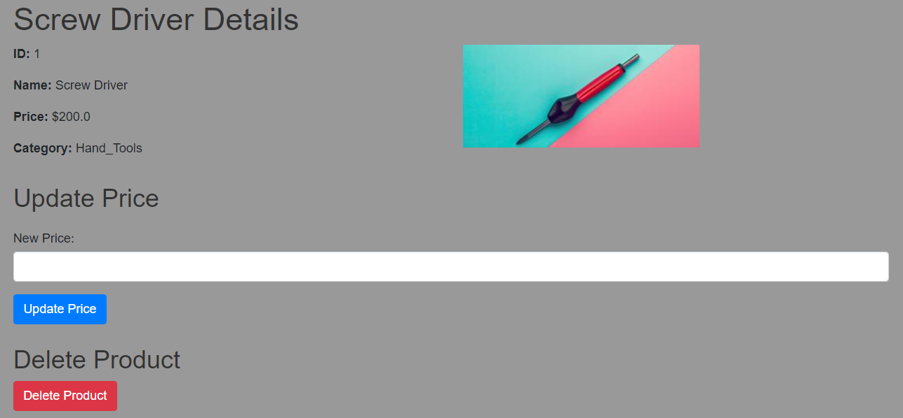

# Product Management Application

## 1. Overview
This project is a web application built using Flask that allows users to manage products. It includes functionalities to add, update, delete, and view products and their associated categories. The application stores data in a Cassandra database and supports image uploads for product representation.

## 2. Features
- **Product Management**: Add, update, and delete products.
- **Category Management**: Automatically add categories if they do not exist.
- **Image Upload**: Upload and store product images.
- **Responsive Design**: Uses Flask-Bootstrap for a responsive layout.
- **RESTful API**: Endpoint to retrieve categories in JSON format.

## 3. Technologies Used
- **Flask**: Web framework for building the application.
- **Flask-Bootstrap**: For styling the application using Bootstrap.
- **Cassandra**: NoSQL database for storing product and category data.
- **Pillow**: Python Imaging Library for image handling.

## 4. Installation Instructions
1. **Clone the Repository:**
   ```bash
   git clone https://github.com/imadharir/Product-Management-Application.git
   cd Product-Management-Application
   ```
2. **Set Up a Virtual Environment:**
    ```bash
    python3 -m venv venv
    source venv/bin/activate  
    ```
3. **Install Dependencies:**
    ```bash
    pip install Flask flask_bootstrap cassandra-driver Pillow
    ```
4. **Set Up Cassandra:**
   - Make sure Cassandra is installed and running.
   - Create the keyspace and tables in the Cassandra CQL shell:
   ```bash 
   CREATE KEYSPACE mykeyspace WITH replication = {'class': 'SimpleStrategy', 'replication_factor': '1'};

    USE mykeyspace;

    CREATE TABLE products (
        product_id int PRIMARY KEY,
        name text,
        price float,
        category text,
        image_url text
    );

    CREATE TABLE categories (
        category text PRIMARY KEY
    );
    ```
## 5. Running the Application
To run the application, execute the following command:
```bash
python app.py
```
Visit `http://127.0.0.1:5000/` in your web browser to access the application.
## 6. Usage:
- **Home Page:** View all products and their details.
- **Add Product:** Fill out the form to add a new product with an image.
- **Update Product:** Update the price of an existing product.
- **Delete Product:** Remove a product from the list.
- **View Categories:** Access the categories through the `/categories` API endpoint.
## 7. API Endpoints
**GET /categories**: Retrieve a list of all categories in JSON format.
## 8. Screenshots

<div align="center">
    <hr style="width: 50%;"/>
</div>


<div align="center">
    <hr style="width: 50%;"/>
</div>


## 9. Future Improvements
- Implement user authentication and authorization.
- Add search functionality for products.
- Enhance error handling and validation.

